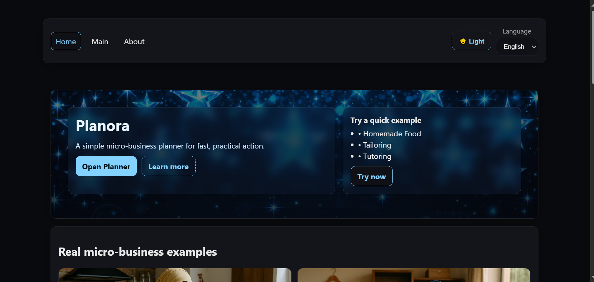
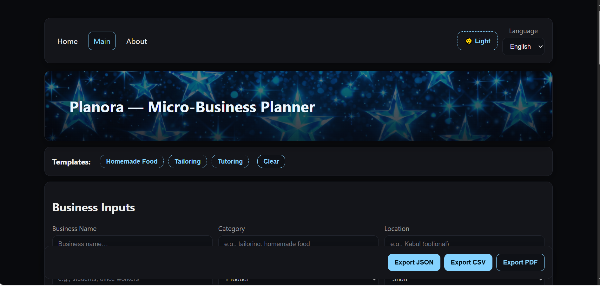
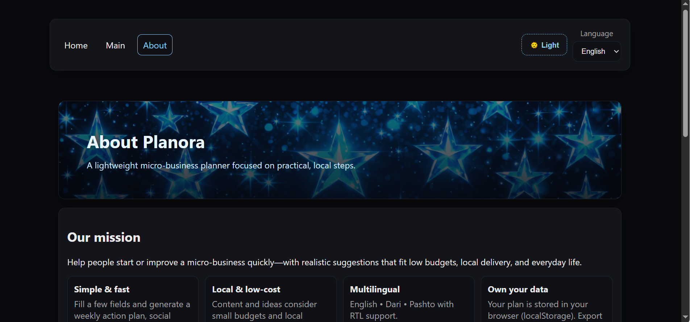

Planora — Micro-Business Planner

Planora helps you draft a tiny, actionable business plan in minutes.
It supports English, Dari, Pashto, RTL layout, dark/light theme, and handy templates for quick starts.
Backend calls go through a Cloudflare Worker that proxies OpenAI.

✨ Features

Multilingual UI: English / Dari / Pashto with automatic RTL for fa/ps

Theme switcher: Dark / Light (persists, system-aware)

One-click templates per language

Generates slogans, a one-week plan, product/service copy & next steps

Export: JSON, CSV, and printable PDF

Responsive layout, accessible controls, keyboard/screen-reader friendly

Clean code: Vite + React + lazy loading + code-splitting

🧱 Tech Stack

Frontend: Vite, React, React Router

Styling: hand-rolled CSS tokens, dark/light theming

API: Cloudflare Worker → OpenAI /chat/completions

Deploy: Vercel (frontend), Cloudflare (API)

🗂 Project Structure
planora/
├─ public/
│ ├─ images/
│ │ ├─ background.png # hero/background
│ └─ favicon.ico # add to silence /favicon.ico
│  
├─ src/
│ ├─ components/ # BudgetChart, PlanForm, PlanOutput, Footer, ...
│ ├─ pages/ # Home, About
│ ├─ lib/ # i18n, schema, prompt, text
│ ├─ App.jsx # routes
│ ├─ AppShell.jsx # main planner page
│ ├─ main.jsx # bootstrapping
│ └─ styles.css # design system & layout
├─ api-worker/ # Cloudflare Worker (OpenAI proxy)
│ └─ src/worker.ts
├─ vercel.json # SPA rewrites (see below)
├─ .gitattributes # normalize line endings
├─ package.json
└─ README.md

screenshorts:

